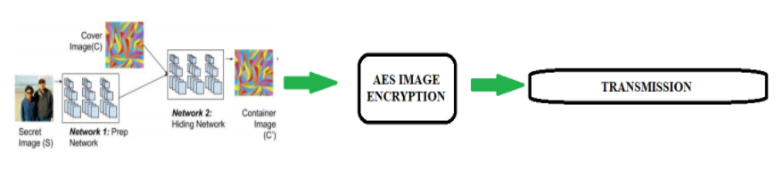
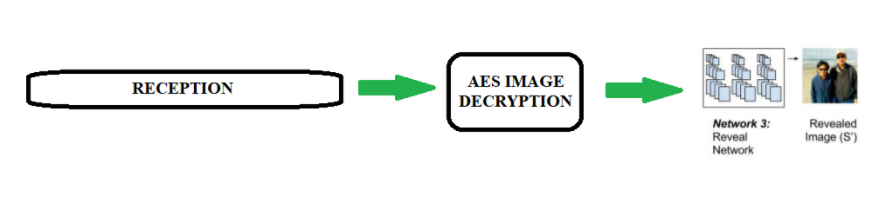
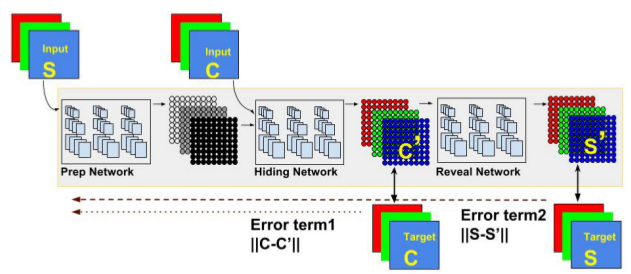
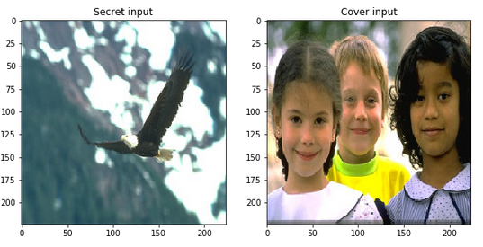
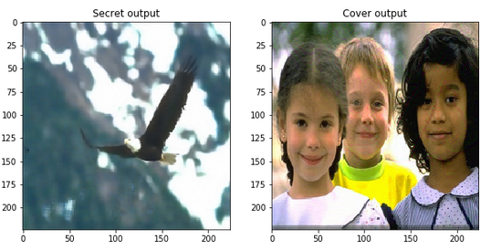

# Visual-Cryptography-with-Deep-neural-Networks with AES encryption

The original Implementation of the Deep neural networks model can be found in this repo: https://github.com/nishchaljs/Deep-Video-Steganography-Hiding-Videos-in-Plain-Sight

**Steganography** is the practice of **concealing a secret message** within another, ordinary, message.The messages can be images, text, video, audio etc. In modern steganography, the goal is to **covertly communicate** a digital message.
The main aim of steganogrpahy is to prevent the detection of a hidden message. It is often combined with **cryptography** to improve the security of the hidden message.**Steganalysis** is the study of detecting messages hidden using steganography (breaking); this is analogous to cryptanalysis applied to cryptography.Steganography is used in **applications** like confidential communication, secret data storing, digital watermarking etc.

The implementation will be done using **keras**, with tensorflow backend.Also, we will be using random images from  **imagenet**dataset for training the model.We will use **50000 images** (RGB-224x224) for training and **7498 images** for validation.

Further, the encoded image is sent through a layer of AES encryption to make it ready for transmission, thus achieving two layers of encryption.

<p align="center">
  
  <br>
  <b>Encryption Process</b>
</p>

<p align="center">
  
  <br>
  <b>Decryption Process</b>
</p>

## Dependencies

* Tensorflow(>=1.14.0), Python 3
* Keras(>=2.2.4)
* Opencv(>3.0), PIL, Matplotlib

## Prerequisites

* Download training [data-set](https://github.com/dusty-nv/jetson-inference/blob/master/docs/imagenet-training.md#downloading-image-recognition-dataset)
* Download evaluation [data-set](https://www.ntu.edu.sg/home/asjfcai/Benchmark_Website/Semantic%20dataset100.zip)
* GPU with CUDA support


## Model Architecture

Our main goal is to **hide a full size (N*N RGB) color image** within another image
of the same size. Deep neural networks are simultaneously trained to create the **hiding and
revealing processes** and are designed to specifically work as a pair. The technique used is **image
compression through auto-encoding networks**.The trained system must learn to compress the
information from the secret image into the **least noticeable portions** of the cover image and then, it
must learn how to **extract and reconstruct** the same information from the encoded message, with
**minimum loss**.

Here is the basic **architecture** diagram

<p align="center">
  
  <br>
  <b>Basic Architecture</b>
</p>

## Implementation

We train the hiding and reveal networks **simultaneously** in the form of an autoencoder, using keras.The model has two inputs corresponding to a pair of secret and cover image and two outputs corresponding to their inputs .Since we are using a **autoencoder** based architecture, the **labels** are same as their corresponding inputs.

The network consists of **three parts** viz. Prepare block, Hide block, Reveal block.In **prepare block**, we  transform the color-based pixels to more useful features for succinctly encoding the images. We then hide this transformed image inside the input cover image using the  **hide block**, to generate the container image.Finally, in the **reveal block** we decode the container image to produce the secret output.Therefore, the model has two inputs and two outputs.

We use a **weighted L2 loss** function along with **Adam optimizer** for training the model.The model is trained for **100 epochs** suing a batch size of 8.

*Loss: L(c, c 0 , s, s 0 ) = ||c − c 0 || + β||s − s 0 ||*


Here c and s are the cover and secret images respectively, and β is how to weigh their reconstruction errors

To ensure that the networks do not simply encode the secret image in the **LSBs**, a small amount of **noise** is added to the output of the second network (e.g. into the generated container image) during training.

After the training, we split the trained model into two: **hide network and reveal network** (we remove noise layer).The **hide network** has two inputs corresponding to **secret and cover image** and one output corresponding to the **container image**. The reveal  network takes the **container image** as input and reveals(decodes) the **secret image** as output.

The hide network is used by the **sender**; while the reveal network is supposed to be used by the **receiver**.The receiver has access only to the container image.In addition to the normal steganographic hiding mechanism, we also **encrypt(block shuffle)** our secret images for added security.Therefore , both the **sender and the receiver** shares a **symmetric key** for encrypting/decrypting the shuffled secret message. The encryption is performed by the sender on the **input secret image**; whereas the decryption is performed by the receiver on the **final decode image**.

Finally images/video are enhanced by applying **Non-local Means Denoising** algorithm and **Unsharp Masking**(USM) filter.

## How to run

1. Download the **imagenet dataset** and put them in **data** folder.
2. Select a **random subset** of images from the  imagenet dataset.
3. Resize all the images to **224*224(RGB)** size.
4. Split the dataset into **training and validation** subsets.

Also ensure the that **evaluation** images(RGB:224x224) are stored in the directory **dataset/eval_data**.

### Directory structure:- 
```
dataset
├── eval_data
├── train_data
│   └── train
└── val_data
    └── validation
```    
Configure the **filepaths and batch-size** in train.py, if needed.

After ensuring the data files are stored in the **desired directories**, run the scripts in the **following order**.

```python
1. python train.py # Train the model on training dataset
2. python eval.py dataset/eval_data checkpoints/steg_model-06-0.03.hdf5 # Evaluate the model on evaluation dataset
3. python test.py test/testdata.npy checkpoints/steg_model-06-0.03.hdf5 # Test the model on test dataset
4. python split_model.py checkpoints/steg_model-06-0.03.hdf5 # Split the model into hide and reveal networks
```
* Use **image_hide.py & image_reveal.py** to test the models on **images**.
* Use **video_hide.py & video_reveal.py** to test the models on **videos**.
* Use **enhance.py** for enhancing the **output** secret video.
* Use **NPS_Autoencoder_Decoder.ipynb** for Final final application with AES encryption


## Demo

### Image Results

Sample results for a pair of input images - Secret & Cover

**Inputs**: Secret and Cover



**Outputs**: Secret and Cover



**Trian MSE:** 0.03, **Test MSE:** 0.02

## Acknowledgments
* https://github.com/nishchaljs/Deep-Video-Steganography-Hiding-Videos-in-Plain-Sight
* https://github.com/harveyslash/-Steganography
* https://towardsdatascience.com/nips-2017-google-hiding-images-in-plain-sight-deep-steganography-with-interactive-code-e5efecae11ed
* https://www.pyimagesearch.com/2018/06/04/keras-multiple-outputs-and-multiple-losses/
* https://machinelearningmastery.com/keras-functional-api-deep-learning/
* http://theorangeduck.com/page/neural-network-not-working
* https://gist.github.com/gyglim/1f8dfb1b5c82627ae3efcfbbadb9f514
* https://opencv-python-tutroals.readthedocs.io/en/latest/py_tutorials/py_photo/py_non_local_means/py_non_local_means.html
* https://stackoverflow.com/questions/52800025/keras-give-input-to-intermediate-layer-and-get-final-output
* https://keras.io/models/model/
